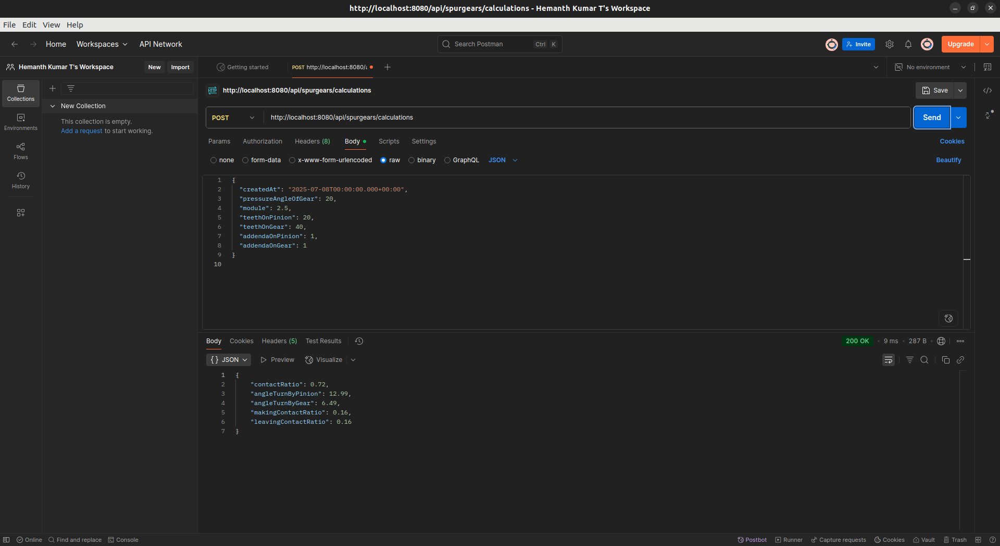
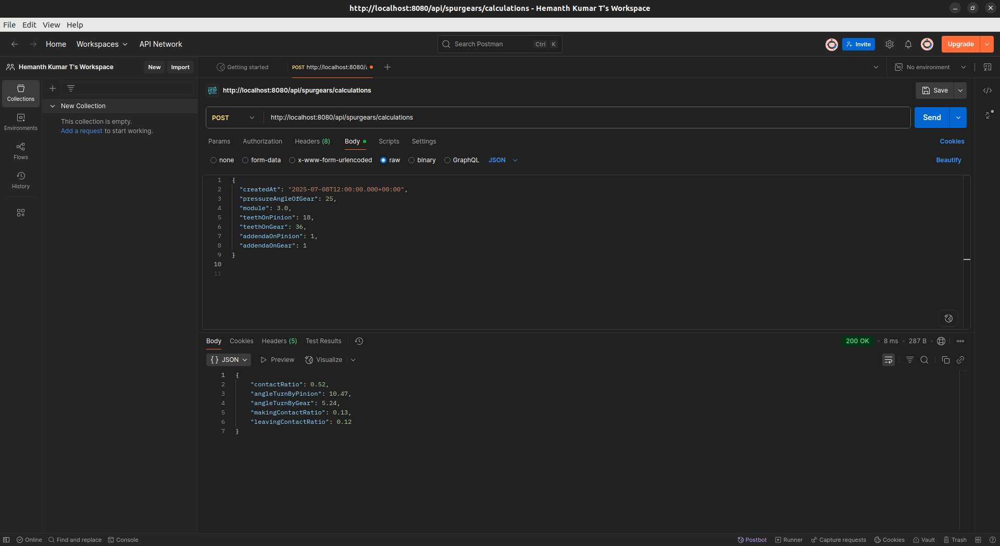
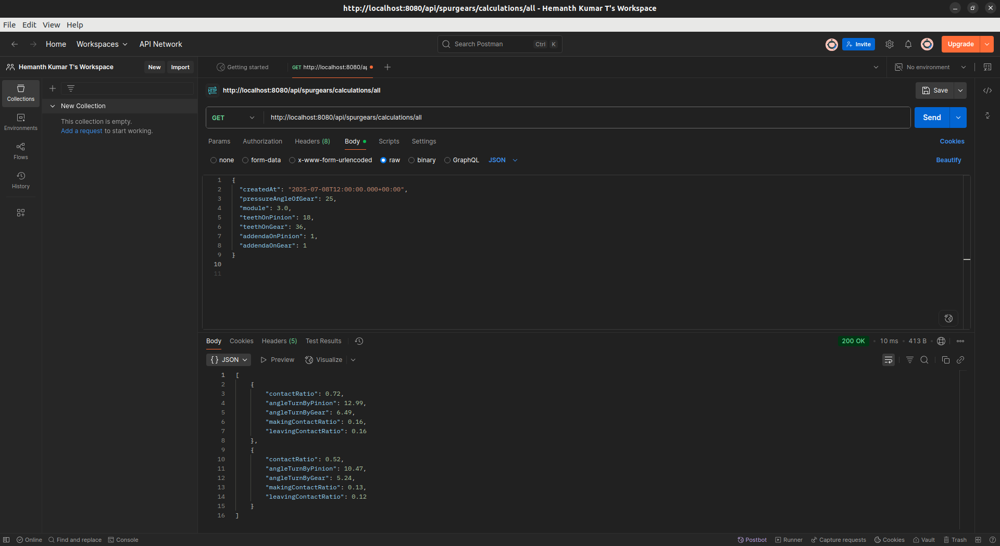
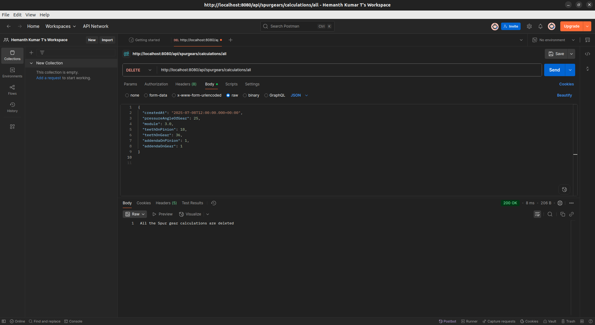
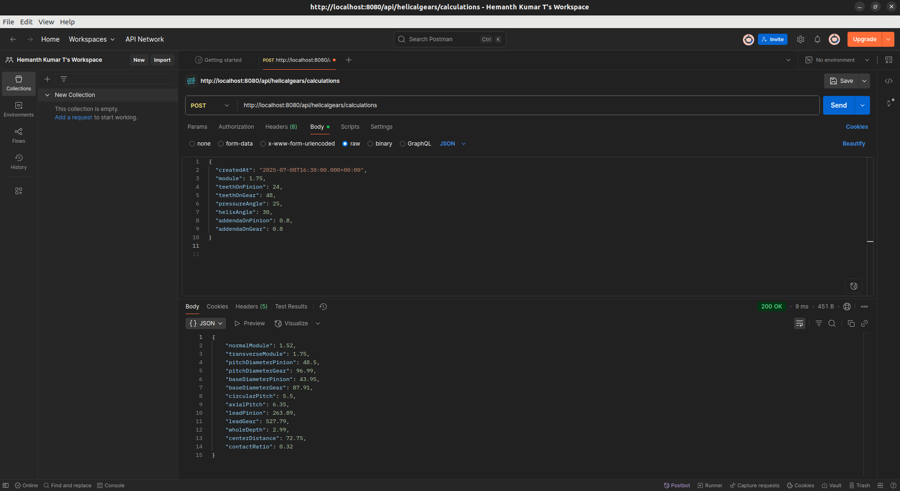
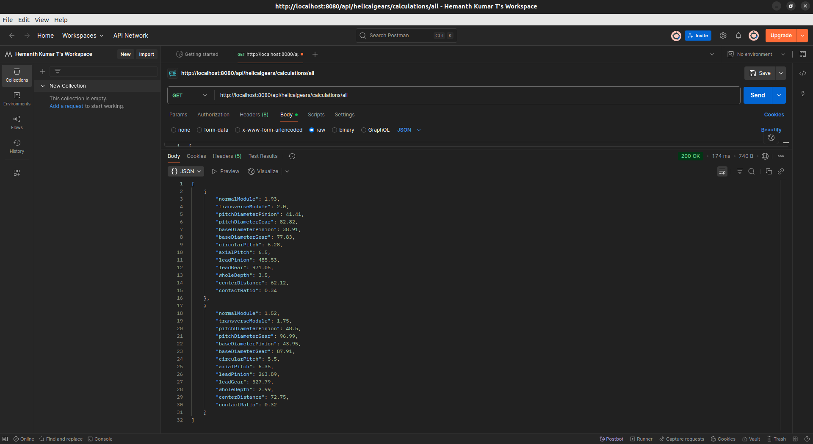
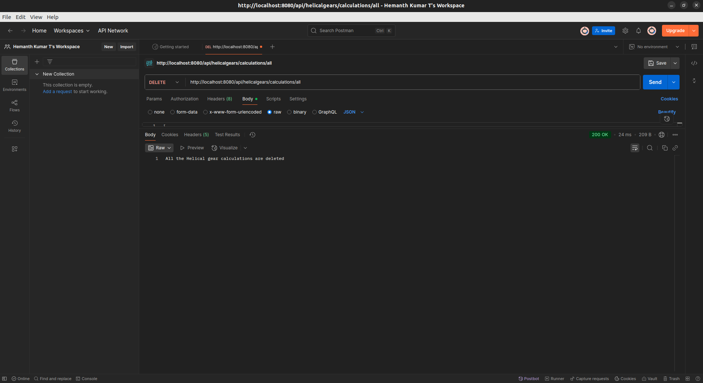

# ⚙️ ForgeBase – Gear Calculation Engine

Spring Boot application that computes **Spur** and **Helical** gear parameters using standard mechanical engineering formulas. Ideal for students and engineers looking to explore backend logic + mechanical domain integration.

> ⚠️ This project is for educational use only. Not validated for manufacturing use.

---

## 🚀 Features

- 🔧 REST APIs for Spur & Helical Gear Calculations  
- 📐 Mechanical logic in `Calculation` classes  
- 🧠 Business logic in `Service` layer  
- 💾 Data stored via Spring Data JPA  
- 🔐 Input validation with `javax.validation`  
- 🎯 Rounded double outputs using `BigDecimal.setScale(...)`  
- 🚮 Full CRUD: Create, Get, Delete by ID & Delete All  
- 🧰 Clean DTO structure for input/output separation

---

## 📁 Project Structure

```bash
forgebase/
├── Controller/
│   ├── SpurGearController.java
│   └── HelicalGearController.java
├── Service/
│   ├── SpurGearService.java
│   └── HelicalGearService.java
├── Model/
│   ├── SpurGearModel.java
│   ├── HelicalGearModel.java
│   ├── SpurGearInputDTO.java
│   └── HelicalGearInputDTO.java
├── Calculations/
│   ├── SpurGearCalculations.java
│   └── HelicalGearCalculations.java
├── Repository/
│   ├── SpurGearRepository.java
│   └── HelicalGearRepository.java
└── ForgebaseApplication.java
```

🔗 API Endpoints

Spur Gear
```
POST    /api/spurgears/calculations
GET     /api/spurgears/calculations/all
GET     /api/spurgears/calculations/{id}
DELETE  /api/spurgears/calculations/{id}
DELETE  /api/spurgears/calculations/all
```
Helical Gear
```
POST    /api/helicalgears/calculations
GET     /api/helicalgears/calculations/all
GET     /api/helicalgears/calculations/{id}
DELETE  /api/helicalgears/calculations/{id}
DELETE  /api/helicalgears/calculations/all
```
📥 Sample Inputs

Spur Gear Input
```
{
  "createdAt": "2025-07-08T16:00:00.000+00:00",
  "pressureAngleOfGear": 20,
  "module": 2.5,
  "teethOnPinion": 18,
  "teethOnGear": 36,
  "addendaOnPinion": 1,
  "addendaOnGear": 1
}
```
Helical Gear Input
```
{
  "createdAt": "2025-07-08T17:00:00.000+00:00",
  "module": 3.0,
  "teethOnPinion": 20,
  "teethOnGear": 40,
  "pressureAngle": 20,
  "helixAngle": 15,
  "addendaOnPinion": 1,
  "addendaOnGear": 1
}
```
### 📸 Spur Gear

  
  
  


---

### 📸 Helical Gear

  
  
  



